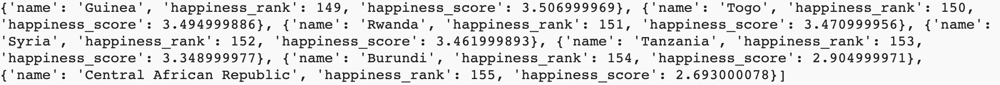
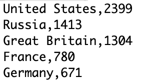

## Choose and load a data set

<div style="display: flex; flex-wrap: wrap">
<div style="flex-basis: 200px; flex-grow: 1; margin-right: 15px;">
Do you have an idea of the kind of display you want to create? Use this step to choose your data and load it into dictionaries. Later, you'll use those dictionaries to build your map.
</div>
<div>

</div>
</div>

{:width="600px"}

--- task ---

Open the [Mapping Data starter project](https://editor.raspberrypi.org/en/projects/mapping-data-starter){:target="_blank"} project. The code editor will open in another browser tab.

If you have a Raspberry Pi account, you can click on the **Save** button to save a copy to your **Projects**.

--- /task ---

--- task ---

Before you can put your data on a map, you'll need to choose some data to display.

**Choose:** There are a few CSV files included in the starter project. Read their descriptions below. Then note the name of the file you'd like to use in your display.

<div style="border-left: solid; border-width:10px; border-color: #0faeb0; background-color: aliceblue; padding: 10px;">
<span style="color: #0faeb0">**CSV files**</span> are Comma-Separated Values files. They contain data in rows and columns, like a table. Each line is a row, with commas separating that row's values into columns.
{:width="200px"}
</div>

--- collapse ---
---
title: Olympic host nations
---

**File name:** `olympics.csv`

This data is a list of regions that have hosted the Olympic Summer Games. The columns of the data are:

 - The name of the region
 - The number of times they have hosted the games

Here is an example of the data in this file:

```
United States,4
United Kingdom,3
Greece,3
```

--- /collapse ---

--- collapse ---
---
title: World population
---

**File name:** `pop.csv`

This data is about populations around the world. The columns of the data are:

 - The name of the region
 - How many people live in the region
 - How many people live in each square kilometre of the region
 - The average age of people in the region
 - The percentage of people in that region who live in cities

Here is an example of the data in this file:

```
Afghanistan,38928346,60,18,25
Albania,2877797,105,36,63
Algeria,43851044,18,29,73
```

--- /collapse ---

--- collapse ---
---
title: Carbon emissions
---

**File name:** `carbon.csv`

This data is about carbon emissions around the world. The numbers in the file are for a single year. The columns of the data are:

 - The name of the region
 - How much carbon each region emits in total (in thousands of tons)
 - How much carbon each region emits, per person that lives in that region (in tons)

Here is an example of the data in this file:

```
Albania,4342.011,1.511
Algeria,130493.653,3.158
Angola,18021.394,0.605
```

--- /collapse ---

--- collapse ---
---
title: Threatened species
---

**File name:** `species.csv`

This data is about the number of plant and animal species that are under threat in each region. The columns of the data are:

 - The name of the region
 - The number of threatened species in that region

Here is an example of the data in this file:

```
Afghanistan,42
Albania,130
Algeria,135
```

--- /collapse ---

--- collapse ---
---
title: National wealth
---

**File name:** `gdp.csv`

The gross domestic product (GDP) of a region measures the size of its economy. Regions with larger GDPs are usually richer. The columns of the data are:

 - The name of the region
 - The total GDP of that region

Here is an example of the data in this file:

```
Aruba,3056424581
Afghanistan,18869945678
Angola,1.22124E+11
```

--- /collapse ---

--- collapse ---
---
title: World happiness
---

**File name:** `happy.csv`

This data is from the world happiness report. The report is a survey of the happiness of people in different regions. People were asked to score their happiness on a scale of 0–10. The columns of the data are:

 - The name of the region
 - Where that region ranks in the world for average happiness
 - The average happiness score for the region

Here is an example of the data in this file:

```
Norway,1,7.537000179
Denmark,2,7.521999836
Iceland,3,7.504000187
```

--- /collapse ---

--- /task ---

--- task ---

Now that you have picked your data, you need to load it into your program.

Define a `load_data()` function to take a `file_name` variable. Have your function open that file and `print()` out every line in it.

[[[parameters]]]

--- code ---
---
language: python
filename: main.py — load_data()
line_numbers: true
line_number_start: 13
line_highlights: 17-20
---
# Put code to run when the mouse is pressed here
def mouse_pressed():
    pixel_colour = Color(get(mouse_x, mouse_y)).hex

def load_data(file_name):
    with open(file_name) as f:
        for line in f:
            print(line)
--- /code ---

**Tip:** You will be moving data around a lot in the next few steps. It's a good idea to `print()` everything out. This will help you understand what your data looks like at each step. It's also good for catching bugs. You can comment the `print()` lines out later (with `#`).

--- /task ---

--- task ---

Add a call to `load_data()` in your `setup()` function. Pass it the name of the data file you chose above. You can check the list below if you need a reminder of the file name.

 - Olympic host nations — `olympics.csv`
 - World population — `pop.csv`
 - Carbon emissions — `carbon.csv`
 - Threatened species — `species.csv`
 - National wealth — `gdp.csv`
 - World happiness — `happy.csv`

--- /task ---

--- task ---

**Test:** Run your program. Check the data that prints out in the output area.

**Debug:** You might get an error message about your file name being 'not defined'. If you do, check that you have put the name in quotes when you call the `load_data()` function. For example, `load_data('pop.csv')`.

--- /task ---

Now the data is loaded, you need to get the data for each region and break it into a list. Then you can load that list into a dictionary.

--- task ---

Add code to your `load_data()` function to use the `split()` function to break each line into a list. Call that list `info`.

--- collapse ---
---
title: Split a text string into a list
---

The `split()` function breaks a string into a list. `split(',')` makes a new list item every time it sees a comma. So,

```python
info = 'Estonia,1326535,31,42,68'
my_list = info.split(',')
```

would put `['Estonia', '1326535', '31', '42', '68']` into `my_list`.

--- /collapse ---

--- code ---
---
language: python
filename: main.py — load_data()
line_numbers: false
line_number_start: 1
line_highlights: 5-6
---
def load_data(file_name):
    with open(file_name) as f:
        for line in f:
            #print(line)
            info = line.split(',')
--- /code ---

--- /task ---

Now use the list you made from each region's data to create a dictionary for each region. Include the name of the region and the numbers you want to use in your display.

--- task ---

Add code to your `load_data()` function that converts the data you've chosen into a dictionary.  

Use `print()` to check the dictionaries look like you expect.

--- collapse ---

---
title: Field names for the csv files
---

Olympic host nations — `olympics.csv`   
   - The name of the region
   - The number of times they have hosted the games   

World population — `pop.csv`   
   - The name of the region
   - How many people live in the region
   - How many people live in each square kilometre of the region
   - The average age of people in the region
   - The percentage of people in that region who live in cities   

Carbon emissions — `carbon.csv`   
  - The name of the region
  - How much carbon each region emits in total (in thousands of tons)
  - How much carbon each region emits, per person that lives in that region (in tons)

Threatened species — `species.csv`   
  - The name of the region
  - The number of threatened species in that region

National wealth — `gdp.csv`
 - The name of the region
 - The total GDP of that region

World happiness — `happy.csv`   
  - The name of the region
  - Happiness rank
  - Happiness score

--- /collapse ---

--- code ---
---
language: python
filename: main.py — load_data()
line_numbers: false
line_number_start: 1
line_highlights: 7-13
---
def load_data(file_name):
    with open(file_name) as f:
        for line in f:
            #print(line)
            info = line.split(',')
            # Change the dictionary to match the data you're using
            region_dict = {
                'region': info[0],
                'happiness rank': info[1],
                'happiness score': info[2]
            }
            print(region_dict)
--- /code ---

--- /task ---

--- task ---

**Test:** Run your code and check that the dictionaries it prints out look like you expect them to: a 'name' key with a text string for a value, and whatever keys and values you expect based on your code.

**Debug:** If you see a message about `list index out of range`, check that you are trying to load the right number of values into your region dictionary. This may be a different number of values to the example code above. You should also use key names that match the data you chose.

--- /task ---

Now your `load_data()` function creates dictionaries for each region. You need to store those dictionaries somewhere the rest of your program can get them. A list is a good choice.

--- task ---

Create an empty list called `region_list`. 

--- code ---
---
language: python
filename: main.py
line_numbers: false
line_number_start: 1
line_highlights: 6
---
#!/bin/python3
from p5 import *
from regions import get_region_coords

region_list = []
--- /code ---

In `load_data()`, add each of your dictionaries to `region_list` using `append`. This will let you work with the data in the rest of your program.

--- code ---
---
language: python
filename: main.py - load_data()
line_numbers: false
line_number_start: 1
line_highlights: 11
---
def load_data(file_name):
    with open(file_name) as f:
        for line in f:
            info = line.split(',')
            region_dict = {
                'region': info[0],
                'happiness rank': info[1],
                'happiness score': info[2]
            }
            #print(region_dict)
            region_list.append(region_dict)

--- /code ---

--- /task ---

--- task ---

Add a line in your `setup()` function that prints the `region_list` out.

--- /task ---

--- task ---

**Test:** Run your program and check that it prints out a list of dictionaries. It should look something like this:


**Tip:** Like the other `print()` statements you've used, you can comment this line out once you've used it for testing and your code works as expected.

--- /task ---

--- task ---

**Debug:** You might find some bugs in your project that you need to fix. Here are some common bugs.

--- collapse ---
---
title: My code doesn't run
---

Check your code is properly indented. The code under the `with` should be indented, and then code under the `for` loop should be indented again.

--- /collapse ---

--- collapse ---
---
title: I get a message that the csv file is 'not defined'
---

Check your call to `load_data()` to be sure that the name of the file is a string.

--- /collapse ---

--- collapse ---
---
title: My info list just has one big item in it
---

Check that you have `','` in the `()` of `line.split()`

--- /collapse ---

--- collapse ---
---
title: I get a message that split is 'not defined'
---

If you see a message about `split` being 'not defined', check that you have included `line.` before it.

--- /collapse ---

--- collapse ---
---
title: I get a message that region_list is 'not defined'
---

If you see a message about `region_list` being 'not defined', check that you have created it as an empty list — with `region_list = []` — before trying to add things to it

--- /collapse ---

--- /task ---

--- save ---
