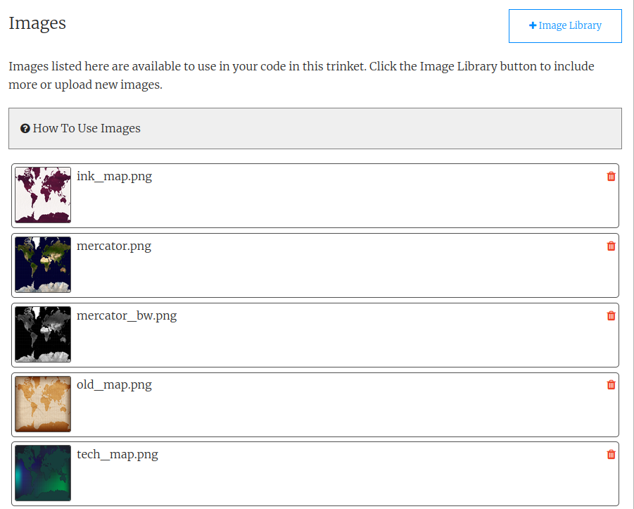
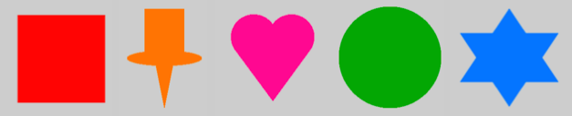

## Pick a map and pins

<div style="display: flex; flex-wrap: wrap">
<div style="flex-basis: 200px; flex-grow: 1; margin-right: 15px;">
Choose how you'll display the data you've selected.
</div>
<div>
{:width="300px"}
</div>
</div>

--- task ---

Add code to your `setup()` function to set the size of your canvas to **991** pixels wide and **768** pixels high.

--- code ---
---
language: python
filename: main.py - setup()
line_numbers: false
line_number_start: 1
line_highlights: 2
---
def setup():  
  size(991, 768)

--- /code ---

--- /task ---

--- task ---

Think about how you want to display the data you've picked: what kind of map do you want to use? 
+ ink_map.jpg
+ mercator.jpeg
+ mercator_bw.png
+ old_map.jpg
+ tech_map.jpg



--- /task ---

--- task ---

**Choose:** The starter project includes several map images. Pick one you like, and load the image in your `setup` function.

--- code ---
---
language: python
filename: main.py - setup()
line_numbers: false
line_number_start: 1
line_highlights: 4
---
def setup():
# Put code to run once here
    size(991, 768)    
    map = load_image('map.jpeg') # Replace with your image

--- /code ---

--- /task ---

--- task ---

Add code to your `setup()` function to draw the map so it covers the whole canvas.

[[[p5-coordinates]]]

--- code ---
---
language: python
filename: main.py - setup()
line_numbers: false
line_number_start: 1
line_highlights: 5-11
---
def setup():
# Put code to run once here
    size(991, 768)    
    map = load_image('map.jpeg') # Replace with your image
  image(
      map, # The image to draw
      0, # The x of the top-left corner
      0, # The y of the top-left corner
      width, # The width of the image
      height # The height of the image
      )
--- /code ---

--- /task ---

--- task ---

**Test:** Run your program and look at your map! You will probably need to switch to the fullscreen view to see the whole map.

--- /task ---

--- task ---

**Choose:** What shape of pin will you place in each location? Your pin will need to be a single colour so that it is easy for a user to click on.

You could choose a single shape, such as:
+ A circle
+ A square
+ A triangle

Or you could create a pin out of multiple geometric shapes, such as:
+ A heart
+ A map pin
+ A star



--- /task ---

--- task ---

Define a function called `draw_pin`. It should draw a pin, of your design, on the map. It should take three parameters:

 - The x coordinate for the pin.
 - The y coordinate for the pin.
 - The colour of the pin. This should be a `p5` `color()`.

[[[parameters]]]

--- collapse ---
---
title: Colours in p5
---

The `p5` `color()` function expects three numbers: one each for red, green, and blue.

```python
blue = color(92, 204, 206) #Red = 92, Green = 204, Blue = 206
```

You can use the `fill()` function to fill a shape with colour. `fill()` applies to every shape drawn after it.

```python
green = color(149, 212, 122)
fill(green)
rect(0, 250, 400, 150) # This shape will be filled with the colour
```

To remove fills completely, call `no_fill()` before drawing your shape(s).

You can set a colour for the border around a shape with the `stroke()` function:

```python
white = color(255, 255, 255)
stroke(white)
rect(0, 250, 400, 150) # This shape will have a white border
```

--- /collapse ---

[[[generic-theory-simple-colours]]]

[[[processing-python-ellipse]]]

[[[processing-python-rect]]]

[[[processing-python-triangle]]]

**Tip:** Your `draw_pin` function can make other shapes out of these basic ones.

--- /task ---

--- task ---

**Test:** Test your map by calling `draw_pin()` from `draw()`. Put the pin anywhere on the map, for now. You're just checking how it looks. Remove the pin when you're happy that the code works.

--- /task ---

--- save ---

--- task ---

**Debug:** You might find some bugs in your project that you need to fix. Here are some common bugs.

--- collapse ---
---
title: My map isn't loading
---

Check the filename really carefully — remember capital letters are different to lower-case letters and punctuation is important.

--- /collapse ---

--- collapse ---
---
title: My map is the wrong size
---

Check the inputs that control the width and height of the image:

```python
  image(
      map, # The image to draw
      0, # The x of the top-left corner
      0, # The y of the top-left corner
      width, # The width of the image
      height # The height of the image
      )
```

--- /collapse ---

--- collapse ---
---
title: My pin isn't appearing
---

Make sure that you have called the `draw_pin()` function in your `draw()` function, and passed it the values it needs. For example:

--- code ---
---
language: python
filename: main.py - draw()
---
  draw_pin(width/2, height/2, color(255,0,0))
--- /code ---

Also, make sure you are calling `draw_pin()` after you call `image()` to create the background. If not, you're drawing the map over the pin!

--- /collapse ---

--- /task ---
