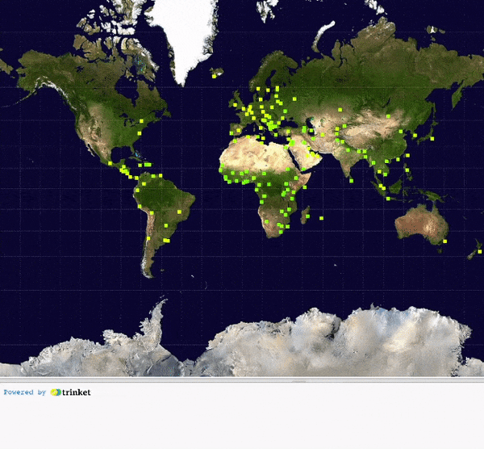
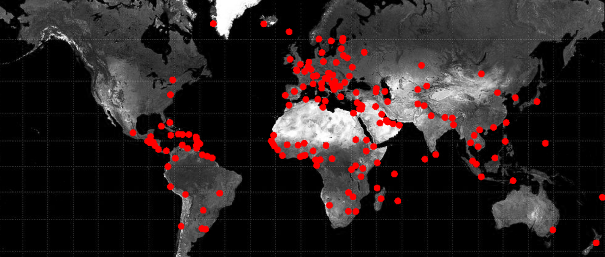

## Mark your data

Display your data on the map, and make it interactive.

{:width="300px"}

Before you can put pins on the map for each place you have data about, you need to know where those places are. The starter project includes code to give you those locations.

You can use `get_region_coords()` to return a dictionary of the coordinates for a region. For example `get_region_coords('Japan')` will return `{'x': 880.151122422, 'y': 278.639809465}`.

--- task ---

Define a `draw_data()` function to put your data on the map. At first you can just print out the region's name and its `x` and `y` coordinates.

It should loop through your `region_list` and print a line for each region.

--- code ---
---
language: python
filename: main.py — draw_data()
---
def draw_data():
  for region in region_list:
    region_name = region['region'] # Get the name of the region
    region_coords = get_region_coords(region_name) # Use the name to get coordinates
    region_x = region_coords['x'] # Get the x coordinate
    region_y = region_coords['y'] # Get the y coordinate
    print(region_name, region_x, region_y)

--- /code ---

--- /task ---

--- task ---

In your `setup()` function, comment out your `draw_pin()` code and instead call `draw_data()`. 

--- code ---
---
language: python
filename: main.py - setup()
line_numbers: false
line_number_start: 1
line_highlights: 12-13
---
def setup():
# Put code to run once here
  size(991, 768)
  map = load_image('map.jpeg') # Replace with your image
  image(
    map, # The image to draw
    0, # The x of the top-left corner
    0, # The y of the top-left corner
    width, # The width of the image
    height # The height of the image
    )
  # draw_pin(300, 300, color(255,0,0))
  draw_data()
  
--- /code ---

--- /task ---

--- task ---

Instead of printing out the name of the region, and its coordinates, you can use your `draw_pin()` function to place your pins on the map. The code below colours the pins red (`color(255, 0, 9)`), but you can choose a different colour.

--- code ---
---
language: python
filename: main.py — draw_data()
line_numbers: false
line_number_start: 1
line_highlights: 7-9
---
def draw_data():
  for region in region_list:
    region_name = region['region'] # Get the name of the region
    region_coords = get_region_coords(region_name) # Use the name to get coordinates
    region_x = region_coords['x'] # Get the x coordinate
    region_y = region_coords['y'] # Get the y coordinate
    #print(region_name, region_x, region_y)
    region_colour = color(255, 0, 0) # Set the pin colour
    draw_pin(region_x, region_y, region_colour) # Draw the pin

--- /code ---

--- /task ---

--- task ---

**Test:** Run your program. You should see lots of pins pop up on your map! Depending on the data you chose, you might see more or fewer pins than in the image below.

--- /task ---

Next, you need to add some code to let users click on a pin and see some information printed out. To do this, each pin needs to be a different colour, and you need a way to match those colours to the right data.

--- task ---

**Choose:** Every pin needs a unique colour. But there are lots of different ways to make this happen. Here are a few suggestions, but you can create your own.

--- collapse ---
---
title: Change the value of one colour
---
This example changes the value for red each time the code places a pin:

--- code ---
---
language: python
filename: main.py — draw_data()
line_numbers: false
line_number_start: 1
line_highlights: 2, 9, 11
---
def draw_data():
  red_value = 255 # Set a starting value for red

  for region in region_list:
    region_name = region['region']
    region_coords = get_region_coords(region_name)
    region_x = region_coords['x']
    region_y = region_coords['y']
    region_colour = color(red_value, 0, 0) # Use the red value in the colour
    draw_pin(region_x, region_y, region_colour)
    red_value -= 1 # Change the red value

--- /code ---

--- /collapse ---

--- collapse ---
---
title: Change the value of multiple colours
---
This example changes the red, green, and blue values each time the code places a pin:

--- code ---
---
language: python
filename: main.py — draw_data()
line_numbers: false
line_number_start: 1
line_highlights: 2-4, 10, 12-14
---
def draw_data():
  red_value = 255 # Set a starting value for red
  blue_value = 0
  green_value = 255
  for region in region_list:
    region_name = region['region']
    region_coords = get_region_coords(region_name)
    region_x = region_coords['x']
    region_y = region_coords['y']
    region_colour = color(red_value, green_value, blue_value) # Use all the colours
    draw_pin(region_x, region_y, region_colour)
    red_value -= 1 # Change the red value
    green_value += 1 # Change the green value
    blue_value -= 1 # Change the blue value 

--- /code ---

--- /collapse ---

--- collapse ---
---
title: Choose random colours
---

At the top of your code, with your other imports, you will need to import `randint` from the `random` library.

You can then choose a random colour for your region colours; a different colour will be picked each time the `for` loop is executed. There is a small chance that two or more colours might end up the same, but it is a very small chance.

--- code ---
---
language: python
filename: main.py — draw_data()
line_numbers: false
line_number_start: 1
line_highlights: 1, 9
---
from random import randint

def draw_data():
  for region in region_list:
    region_name = region['region']
    region_coords = get_region_coords(region_name)
    region_x = region_coords['x']
    region_y = region_coords['y']
    region_colour = color(randint(0,255), randint(0,255), randint(0,255)) # Select a random colour
    draw_pin(region_x, region_y, region_colour)

--- /code ---

--- /collapse ---

--- /task ---

--- task ---

**Test:** Run your program and check that the pins are different colours. If you don't have many pins, it may be hard to tell. In that case, try using bigger changes between each pin.

--- /task ---

Your map has unique pins for each location, but you need to add some code to connect those pins to the information you want to show your users.

--- task ---

To use the pin's colour to look up the information, you need to **create a dictionary** to store the colours and link them to the region.

--- code ---
---
language: python
filename: main.py
line_numbers: false
line_number_start: 1
line_highlights: 7
---
#!/bin/python3
from p5 import *
from regions import get_region_coords
from random import randint

region_list = []
colours = {}
--- /code ---

--- /task ---

--- task ---

As the pins are placed, the `region` can be stored in the dictionary along with the colour of the pin.

--- code ---
---
language: python
filename: main.py
line_numbers: false
line_number_start: 1
line_highlights: 9
---
def draw_data():
  red_value = 255
  for region in region_list:
    region_name = region['region'] # Get the name of the region
    region_coords = get_region_coords(region_name) # Use the name to get coordinates
    region_x = region_coords['x'] # Get the x coordinate
    region_y = region_coords['y'] # Get the y coordinate
    region_colour = color(i, 100, 0) # Set the pin colour
    colours[region_colour] = region
    draw_pin(region_x, region_y, region_colour)
    rev_value -= 1 -= 1
--- /code ---

--- /task ---

When the user clicks on a pin, the colour of the pin is retrieved, and then the corresponding region is found in the dictionary.

--- task ---

In your `mouse_pressed()` function, lookup the `pixel_colour` in the `colours` dictionary and print out the `region`.

**Remember** that `colours` is a dictionary of dictionaries. You will have to get the dictionary of region information, then get the information from inside that dictionary. For example:

--- code ---
---
language: python
filename: main.py
line_numbers: false
line_number_start: 1
line_highlights: 4-5
---
def mouse_pressed():
# Put code to run when the mouse is pressed here
  pixel_colour = color(get(mouse_x, mouse_y))
  facts = colours[pixel_colour]
  print(facts['region'])
--- /code ---

--- /task ---

--- task ---

It's important to check if a key is in a dictionary. If you click on an area of the map without a pin, you will receive a `KeyError`.

You can check if a value is in a dictionary by using `in`:

--- code ---
---
language: python
filename: main.py
line_numbers: false
line_number_start: 1
line_highlights: 4-8
---
def mouse_pressed():
# Put code to run when the mouse is pressed here
  pixel_colour = color(get(mouse_x, mouse_y))
  if pixel_colour in colours:
    facts = colours[pixel_colour]
    print(facts['region'])
  else:
    print('Region not detected')
--- /code ---

--- /task ---

--- task ---

**Test:** Run your program. Click on a pin and check that your program correctly prints out data about that area. 

--- /task ---

--- task ---

You can print out other facts about the region you clicked on by adding more `print()` statements. This will depend on the data set that you used. If you used `happy.csv` for instance, you could print the following:

--- code ---
---
language: python
filename: main.py
line_numbers: false
line_number_start: 1
line_highlights: 7-8
---
def mouse_pressed():
# Put code to run when the mouse is pressed here
  pixel_colour = color(get(mouse_x, mouse_y))
  if pixel_colour in colours:
    facts = colours[pixel_colour]
    print(facts['region'])
    print(facts['happiness_rank']) # Your first data fact
    print(facts['happiness_score']) # Your second data fact
  else:
    print('Region not detected')
--- /code ---

--- /task ---

--- task ---

**Debug:** You might find some bugs in your project that you need to fix. Here are some common bugs.

--- collapse ---
---
title: My pins do not appear on the map
---

If your pins are not appearing on the map, check that you are calling your `draw_data()` function from your `draw()` function.

--- /collapse ---

--- collapse ---
---
title: I get a message about a 'KeyError'
---

If you get a message about 'KeyError', check that the spelling of your dictionary keys match when you put values in and when you read them out. Whether the letters are UPPER CASE or lower case is important too.

If the error is for the `colours` dictionary, make sure you check the key exists in `colours` before trying to get the value.

--- /collapse ---

--- collapse ---
---
title: It keeps displaying 'Region not detected'
---

Your mouse click needs to be in the centre of your pin to make sure that it detects the correct colour.

Try clicking closer to the centre of your pin. 

--- /collapse ---

--- /task ---

--- save ---
