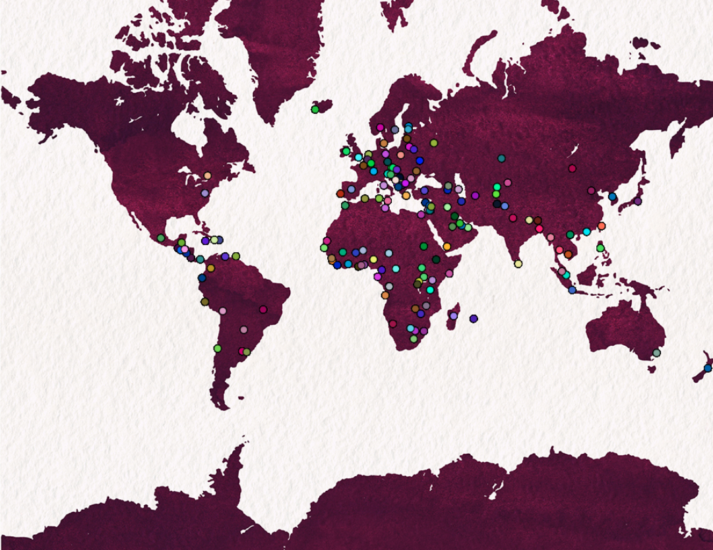

## You will make

Use Python to make an interactive map that lets users learn interesting facts about the world.

You will:
+ Use lists and dictionaries to store data
+ Use functions and parameters to keep your code clean
+ Use code to quickly explore large amounts of data

--- no-print ---

--- task ---

### Play ▶️

Run this example.

Click on the coloured pins to see information about that region printed out. Think about the kind of data you would like to display, and how you could design an interesting shaped pin to mark it on a map.

**World happiness measures**:
<iframe src="https://editor.raspberrypi.org/en/embed/viewer/world-happiness-measures" width="600" height="600" frameborder="0" marginwidth="0" marginheight="0" allowfullscreen>
</iframe> You can find the World happiness measures project [here](https://editor.raspberrypi.org/en/projects/world-happiness-measures){:target="_blank"}

--- /task ---

**Map projections** are the different ways of drawing the Earth on a map. It's not possible to make a 2D map that shows the true sizes and distances that exist in the 3D world, although map-makers are getting better at it. The map in this project uses the web mercator projection — the same one used by sites like Google Maps. This projection makes places nearer the poles look bigger than they are: Greenland is a lot smaller than this map shows and, by comparison, Africa is a lot bigger.

### Get ideas 💭

You are going to make some design decisions about what data you want to show to your users, as well as what style of map and pins you will use to display that data.

--- task ---

Explore these example projects to get more ideas:

**Ink world happiness**:
<iframe src="https://editor.raspberrypi.org/en/embed/viewer/ink-world-happiness" width="600" height="600" frameborder="0" marginwidth="0" marginheight="0" allowfullscreen>
</iframe> You can find the Ink world happiness project [here](https://editor.raspberrypi.org/en/projects/ink-world-happiness){:target="_blank"}

**World carbon data**:
<iframe src="https://editor.raspberrypi.org/en/embed/viewer/world-carbon-data" width="600" height="600" frameborder="0" marginwidth="0" marginheight="0" allowfullscreen>
</iframe> You can find the World carbon data project [here](https://editor.raspberrypi.org/en/projects/world-carbon-data){:target="_blank"}

**GDP**:
<iframe src="https://editor.raspberrypi.org/en/embed/viewer/mapping-data-gdp" width="600" height="600" frameborder="0" marginwidth="0" marginheight="0" allowfullscreen>
</iframe> You can find the GDP project [here](https://editor.raspberrypi.org/en/projects/mapping-data-gdp){:target="_blank"}

--- /task ---

--- /no-print ---

--- print-only ---

### Get ideas 💭

You are going to make some design decisions about what data you want to show to your users, as well as what style of map and pins you will use to display that data.

{:width="300px"}
You can find the World happiness measures project here https://editor.raspberrypi.org/en/projects/world-happiness-measures {:width="300px"}
You can find the Ink world happiness project here https://editor.raspberrypi.org/en/projects/ink-world-happiness {:width="300px"}
You can find the World carbon data project here https://editor.raspberrypi.org/en/projects/world-carbon-data {:width="300px"}
You can find the GDP project here https://editor.raspberrypi.org/en/projects/mapping-data-gdp

--- /print-only ---

