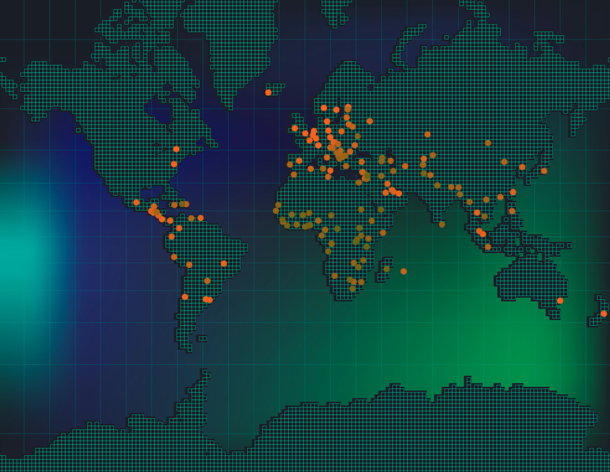
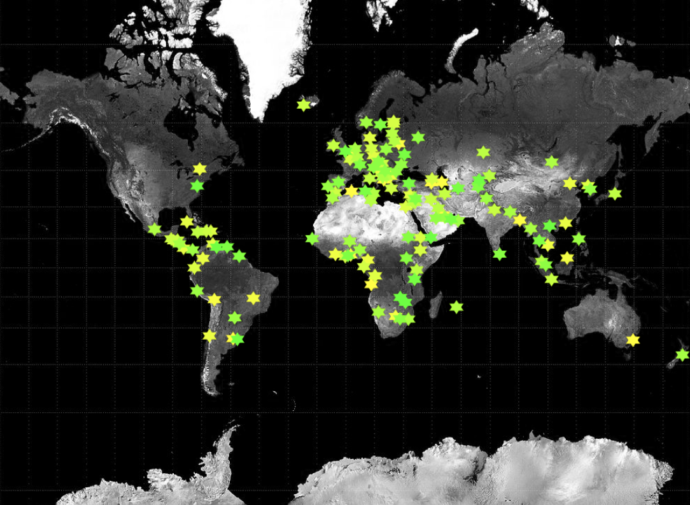

## Ce que tu vas faire

Utilise Python pour créer une carte interactive permettant aux utilisateurs d'apprendre des faits intéressants sur le monde.

Tu vas :
+ Utiliser des listes et des dictionnaires pour stocker des données
+ Utiliser des fonctions et des paramètres pour rendre ton code plus clair
+ Utiliser du code pour explorer rapidement de grandes quantités de données

--- no-print ---

--- task ---

### Joue ▶️

Exécute cet exemple.

Clique sur les épingles colorées pour imprimer les informations relatives à cette région. Réfléchis au type de données que tu aimerais afficher et à la manière dont tu pourrais concevoir une épingle de forme intéressante pour les afficher sur une carte.

**Mesures du bonheur dans le monde:**:
<iframe src="https://editor.raspberrypi.org/en/embed/viewer/world-happiness-measures" width="600" height="600" frameborder="0" marginwidth="0" marginheight="0" allowfullscreen>
</iframe> Tu peux trouver le projet de mesures du bonheur dans le monde [ici](https://editor.raspberrypi.org/en/projects/world-happiness-measures){:target="_blank"}

--- /task ---

**Les projections cartographiques** sont les différentes façons de dessiner la Terre sur une carte. Il n'est pas possible de créer une carte 2D montrant les véritables tailles et distances qui existent dans le monde 3D, même si les cartographes s'améliorent. La carte de ce projet utilise la projection mercator web — la même que celle utilisée par des sites comme Google Maps. Cette projection donne l’impression que les endroits proches des pôles sont plus grands qu’ils ne le sont : le Groenland est beaucoup plus petit que ce que montre cette carte et, en comparaison, l’Afrique est beaucoup plus grande.

### Trouver des idées 💭

Tu vas devoir prendre des décisions concernant les données que tu souhaites montrer à tes utilisateurs, ainsi que le style de carte et d'épingles que tu utiliseras pour afficher ces données.

--- task ---

Explore ces exemples de projets pour obtenir plus d'idées :

**Cartographie de la mesure du bonheur dans le monde :**
<iframe src="https://editor.raspberrypi.org/en/embed/viewer/ink-world-happiness" width="600" height="600" frameborder="0" marginwidth="0" marginheight="0" allowfullscreen>
</iframe> Tu peux trouver le projet Cartographie de la mesure du bonheur dans le monde [ici](https://editor.raspberrypi.org/en/projects/ink-world-happiness){:target="_blank"}

**Données mondiales sur le carbone :**
<iframe src="https://editor.raspberrypi.org/en/embed/viewer/world-carbon-data" width="600" height="600" frameborder="0" marginwidth="0" marginheight="0" allowfullscreen>
</iframe> Tu peux trouver le projet Données mondiales sur le carbone [ici](https://editor.raspberrypi.org/en/projects/world-carbon-data){:target="_blank"}

**PIB :**
<iframe src="https://editor.raspberrypi.org/en/embed/viewer/mapping-data-gdp" width="600" height="600" frameborder="0" marginwidth="0" marginheight="0" allowfullscreen>
</iframe> Tu peux trouver le projet PIB [ici](https://editor.raspberrypi.org/en/projects/mapping-data-gdp){:target="_blank"}

--- /task ---

--- /no-print ---

--- print-only ---

### Trouver des idées 💭

Tu vas devoir prendre des décisions concernant les données que tu souhaites montrer à tes utilisateurs, ainsi que le style de carte et d'épingles que tu utiliseras pour afficher ces données.

{:width="300px"}
Tu peux trouver le projet Mesures du bonheur dans le monde ici https://editor.raspberrypi.org/fr/projects/world-happiness-measures {:width="300px"}
Tu peux trouver le projet Cartographie de la mesure du bonheur dans le monde ici https://editor.raspberrypi.org/fr/projects/ink-world-happiness {:width="300px"}
Tu peux trouver le projet Données mondiales sur le carbone ici https://editor.raspberrypi.org/fr/projects/world-carbon-data {:width="300px"}
Tu peux trouver le projet PIB ici https://editor.raspberrypi.org/fr/projects/mapping-data-gdp

--- /print-only ---

