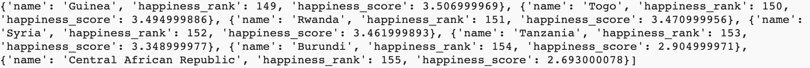
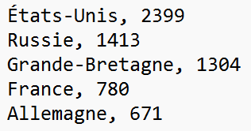

## Choisir et charger un jeu de données

<div style="display: flex; flex-wrap: wrap">
<div style="flex-basis: 200px; flex-grow: 1; margin-right: 15px;">
As-tu une idée du type d'affichage que tu veux créer ? Utilise cette étape pour choisir tes données et les charger dans des dictionnaires. Plus tard, tu utiliseras ces dictionnaires pour créer ta carte.
</div>
<div>

</div>
</div>

{:width="600px"}

--- task ---

Ouvre le projet [Projet de démarrage Cartographier des données](https://editor.raspberrypi.org/fr-FR/projects/mapping-data-starter){:target="_blank"}. Le Code Editor s'ouvrira dans un autre onglet du navigateur.

Si tu as un compte Raspberry Pi, tu peux cliquer sur le bouton **Enregistrer** pour enregistrer une copie dans tes **Projets**.

--- /task ---

--- task ---

Avant de pouvoir placer tes données sur une carte, tu devras choisir les données à afficher.

**Choisis :** Quelques fichiers CSV sont inclus dans le projet de démarrage. Lis leurs descriptions ci-dessous. Note ensuite le nom du fichier que tu souhaites utiliser dans ton affichage.

<div style="border-left: solid; border-width:10px; border-color: #0faeb0; background-color: aliceblue; padding: 10px;">
<span style="color: #0faeb0">**Les fichiers CSV**</span> sont des fichiers de valeurs séparées par des virgules. Ils contiennent des données en lignes et en colonnes, comme un tableau. Chaque ligne est un enregistrement, avec des virgules séparant les valeurs de cette ligne en colonnes.
{:width="200px"}
</div>

--- collapse ---
---
title: Pays d'accueil des Jeux olympiques
---

**Nom du fichier :** `olympics.csv`

Ces données sont une liste des régions qui ont accueilli les Jeux Olympiques d'été. Les colonnes des données sont :

 - Le nom de la région
 - Le nombre de fois qu'ils ont accueilli les jeux

Voici un exemple des données de ce fichier :

```
États-Unis,4
Royaume-Uni,3
Grèce,3
```

--- /collapse ---

--- collapse ---
---
title: Population mondiale
---

**Nom du fichier :** `pop.csv`

Ces données concernent les populations du monde entier. Les colonnes des données sont :

 - Le nom de la région
 - Combien de personnes vivent dans la région
 - Combien de personnes vivent dans chaque kilomètre carré de la région
 - L'âge moyen des habitants de la région
 - Le pourcentage de personnes dans cette région qui vivent dans des villes

Voici un exemple des données de ce fichier :

```
Afghanistan,38928346,60,18,25
Albanie,2877797,105,36,63
Algérie,43851044,18,29,73
```

--- /collapse ---

--- collapse ---
---
title: Émissions de carbone
---

**Nom du fichier :** `carbon.csv`

Ces données concernent les émissions de carbone dans le monde. Les chiffres du dossier concernent une seule année. Les colonnes des données sont :

 - Le nom de la région
 - Quelle quantité de carbone chaque région émet-elle au total (en milliers de tonnes)
 - Quantité de carbone émise par chaque région, par personne vivant dans cette région (en tonnes)

Voici un exemple des données de ce fichier :

```
Albanie,4342.011,1.511
Algérie,130493.653,3.158
Angola,18021.394,0.605
```

--- /collapse ---

--- collapse ---
---
title: Espèces menacées
---

**Nom du fichier :** `species.csv`

Ces données concernent le nombre d’espèces végétales et animales menacées dans chaque région. Les colonnes des données sont :

 - Le nom de la région
 - Le nombre d'espèces menacées dans cette région

Voici un exemple des données de ce fichier :

```
Afghanistan,42
Albanie,130
Algérie,135
```

--- /collapse ---

--- collapse ---
---
title: Richesse nationale
---

**Nom du fichier :** `gdp.csv`

Le produit intérieur brut (PIB) d'une région mesure la taille de son économie. Les régions avec des PIB plus élevés sont généralement plus riches. Les colonnes des données sont :

 - Le nom de la région
 - Le PIB total de cette région

Voici un exemple des données de ce fichier :

```
Aruba,3056424581
Afghanistan,18869945678
Angola,1.22124E+11
```

--- /collapse ---

--- collapse ---
---
title: Le niveau de bonheur mondial
---

**Nom du fichier :** `happy.csv`

Ces données proviennent du rapport sur le bonheur dans le monde. Le rapport est une enquête sur le bonheur des habitants de différentes régions. Il a été demandé aux gens d’évaluer leur bonheur sur une échelle de 0 à 10. Les colonnes des données sont :

 - Le nom de la région
 - Classement de la région dans le monde pour le bonheur moyen
 - Le score de bonheur moyen de la région

Voici un exemple des données de ce fichier :

```
Norvège,1,7.537000179
Danemark,2,7.521999836
Islande,3,7.504000187
```

--- /collapse ---

--- /task ---

--- task ---

Maintenant que tu as sélectionné tes données, tu dois les charger dans ton programme.

Définis une fonction `charge_donnees()` qui accepte une variable `nom_fichier`. Ta fonction doit ouvrir ce fichier et `print()` chaque ligne qu'il contient.

[[[parameters]]]

--- code ---
---
language: python
filename: main.py — load_data()
line_numbers: true
line_number_start: 13
line_highlights: 17-20
---
# Place ici le code à exécuter lorsque la souris est cliquée
def mouse_pressed():
    couleur_pixel = Color(get(mouse_x, mouse_y)).hex

def charge_donnees(nom_fichier):
    with open(nom_fichier) as f:
        for ligne in f:
            print(ligne)
--- /code ---

**Astuce :** Tu vas déplacer beaucoup de données dans les prochaines étapes. C'est une bonne idée de `print()` tout. Cela t'aidera à comprendre à quoi ressemblent tes données à chaque étape. C'est aussi un bon moyen de repérer les bogues. Tu peux mettre le `print()` en commentaire par la suite (avec `#`).

--- /task ---

--- task ---

Ajoute un appel à `charge_donnees()` dans ta fonction `setup()`, tu pourras supprimer l'instruction `pass` qui y est déjà. Passe-lui le nom du fichier de données que tu as choisi ci-dessus. Tu peux consulter la liste ci-dessous si tu as besoin d'un rappel du nom du fichier.

 - Pays d'accueil des jeux olympiques — `olympics.csv`
 - Population mondiale — `pop.csv`
 - Émissions de carbone — `carbon.csv`
 - Espèces menacées — `species.csv`
 - Richesse nationale — `gdp.csv`
 - Niveau de bonheur mondial — `happy.csv`

--- /task ---

--- task ---

**Test :** Exécute ton programme. Vérifie les données affichées dans la zone de sortie.

**Débogage :** Tu pourrais recevoir un message d'erreur indiquant que le nom de ton fichier est 'non défini'. Si c'est le cas, vérifie que tu as mis le nom entre guillemets lorsque tu appelles la fonction `charge_donnees()`. Par exemple, `charge_donnees('pop.csv')`.

--- /task ---

Maintenant que les données sont chargées, tu dois récupérer les données de chaque région et les répartir dans une liste. Tu peux ensuite charger cette liste dans un dictionnaire.

--- task ---

Ajoute du code à ta fonction `charge_donnees()` pour utiliser la fonction `split()` afin de diviser chaque ligne en une liste. Appelle cette liste `info`.

--- collapse ---
---
title: Diviser une chaîne de caractères en une liste
---

La fonction `split()` divise une chaîne de caractères en une liste. `split(',')` crée un nouvel élément de liste à chaque fois qu'il voit une virgule. Donc,

```python
info = 'Estonie,1326535,31,42,68'
ma_liste = info.split(',')
```

mettrait `['Estonie', '1326535', '31', '42', '68']` dans `my_list`.

--- /collapse ---

--- code ---
---
language: python
filename: main.py — load_data()
line_numbers: false
line_number_start: 
line_highlights: 5-6
---
def charge_donnees(nom_fichier):
    with open(nom_fichier) as f:
        for ligne in f:
            #print(ligne)
            info = ligne.split(',')
--- /code ---

--- /task ---

Utilise maintenant la liste que tu as créée à partir des données de chaque région pour créer un dictionnaire pour chaque région. Indique le nom de la région et les valeurs que tu souhaites utiliser dans ton affichage.

--- task ---

Ajoute du code à ta fonction `charge_donnees()` pour convertir les données que tu as choisies en un dictionnaire.

Utilise la fonction `print()` pour vérifier que les dictionnaires ressemblent à ce que tu attendais.

--- collapse ---

---
title: Noms des champs pour les fichiers csv
---

Pays d'accueil des jeux olympiques — `olympics.csv`
   - Le nom de la région
   - Le nombre de fois qu'ils ont accueilli les jeux

Population mondiale — `pop.csv`
   - Le nom de la région
   - Combien de personnes vivent dans la région
   - Combien de personnes vivent dans chaque kilomètre carré de la région
   - L'âge moyen des habitants de la région
   - Le pourcentage de personnes dans cette région qui vivent dans des villes

Émissions de carbone — `carbon.csv`
  - Le nom de la région
  - Quelle quantité de carbone chaque région émet-elle au total (en milliers de tonnes)
  - Quantité de carbone émise par chaque région, par personne vivant dans cette région (en tonnes)

Espèces menacées — `species.csv`
  - Le nom de la région
  - Le nombre d'espèces menacées dans cette région

Richesse nationale — `gdp.csv`
 - Le nom de la région
 - Le PIB total de cette région

Niveau de bonheur mondial — `happy.csv`
  - Le nom de la région
  - Classement du bonheur
  - Score de bonheur

--- /collapse ---

--- code ---
---
language: python
filename: main.py — load_data()
line_numbers: false
line_number_start: 
line_highlights: 7-13
---
def charge_donnees(nom_fichier):
    with open(nom_fichier) as f:
        for ligne in f:
            #print(ligne)
            info = ligne.split(',')
            # Modifie le dictionnaire pour qu'il corresponde aux données que tu utilises
            dico_regions = {
                'region': info[0],
                'rang de bonheur': info[1],
                'classement du bonheur': info[2]
            }
            print(dico_regions)
--- /code ---

--- /task ---

--- task ---

**Test:** Exécute ton code et vérifie que les dictionnaires qu'il imprime ressemblent à ce que tu attendais : une clé 'nom' avec une chaîne de texte comme valeur, et toutes clés et valeurs que tu attendais en fonction de ton code.

**Débogage :** Si tu vois un message concernant `list index out of range`, vérifie que tu essaies de charger le bon nombre de valeurs dans ton dictionnaire de région. Il peut s'agir d'un nombre de valeurs différent de celui de l'exemple de code ci-dessus. Tu dois également utiliser des noms de clés qui correspondent aux données que tu as choisies.

--- /task ---

Maintenant, ta fonction `charge_donnees()` crée des dictionnaires pour chaque région. Tu dois stocker ces dictionnaires dans un endroit où le reste de ton programme peut les obtenir. Une liste est un bon choix.

--- task ---

Crée une liste vide appelée `liste_regions`.

--- code ---
---
language: python
filename: main.py
line_numbers: false
line_number_start: 
line_highlights: 6
---
#!/bin/python3
from p5 import *
from regions import get_region_coords

liste_regions = []
--- /code ---

Dans `charge_donnees()`, ajoute chacun de tes dictionnaires à `liste_regions` en utilisant `append`. Cela te permettra de travailler avec les données dans le reste de ton programme.

--- code ---
---
language: python
filename: main.py - load_data()
line_numbers: false
line_number_start: 
line_highlights: 11
---
def charge_donnees(nom_fichier):
    with open(nom_fichier) as f:
        for ligne in f:
            info = ligne.split(',')
            dico_regions = {
                'region': info[0],
                'rang de bonheur': info[1],
                'classement du bonheur': info[2]
            }
            #print(dico_regions)
            liste_regions.append(dico_regions)

--- /code ---

--- /task ---

--- task ---

Ajoute une ligne dans ta fonction `setup()` qui imprime la `liste_regions`.

--- /task ---

--- task ---

**Test :** Exécute ton programme et vérifie qu'il imprime une liste de dictionnaires. Ça devrait ressembler à ceci :


**Astuce :** Comme pour les autres instructions `print()` que tu as utilisées, tu peux commenter cette ligne une fois que tu l'as utilisée pour tester et que ton code fonctionne comme prévu.

--- /task ---

--- task ---

**Débogage :** il est possible que tu trouves des bogues dans ton projet que tu dois corriger. Voici quelques bogues courants.

--- collapse ---
---
title: Mon code ne s'exécute pas
---

Vérifie que ton code est correctement indenté. Le code dans la boucle `with` doit être indenté, et le code sous la boucle `for` doit être indenté également.

--- /collapse ---

--- collapse ---
---
title: Je reçois un message indiquant que le fichier csv est 'non défini.'
---

Vérifie ton appel à `charge_donnees()` pour être sûr que le nom du fichier est une chaîne.

--- /collapse ---

--- collapse ---
---
title: Ma liste info ne contient qu'un seul gros élément
---

Vérifie que tu as `','` dans les `()` de `ligne.split()`

--- /collapse ---

--- collapse ---
---
title: Je reçois un message selon lequel split est 'non défini'
---

Si tu reçois un message selon lequel `split` est 'non défini', vérifie que tu as bien inclus `ligne.` avant celui-ci.

--- /collapse ---

--- collapse ---
---
title: Je reçois un message selon lequel liste_regions est 'non défini'
---

Si tu reçois un message selon lequel `liste_regions` est 'non defini', vérifie que tu l'as créée comme liste vide — avec `liste_regions = []` — avant d'essayer d'y ajouter des valeurs

--- /collapse ---

--- /task ---

--- save ---
