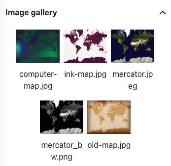

## Choisir une carte et des épingles

<div style="display: flex; flex-wrap: wrap">
<div style="flex-basis: 200px; flex-grow: 1; margin-right: 15px;">
Choisis comment tu vas afficher les données que tu as choisies.
</div>
<div>
{:width="300px"}
</div>
</div>

--- task ---

Ajoute du code dans ta fonction `setup()` pour régler la taille de ton canevas à **991** pixels de large et **768** pixels de haut.

--- code ---
---
language: python
filename: main.py - setup()
line_numbers: false
line_number_start: 
line_highlights: 3
---
# Mettre le code à exécuter une fois ici
def setup():
    size(991, 768)
    charge_donnees('happy.csv')  
    

--- /code ---

--- /task ---

--- task ---

Réfléchis à la façon dont tu veux afficher les données que tu as choisies : quel type de carte veux-tu utiliser ?
+ ink-map.jpg
+ mercator.jpeg
+ mercator_bw.png
+ old-map.jpg
+ computer-map.jpg



--- /task ---

--- task ---

**Choisis :** Le projet de départ inclut cinq images de carte. Choisis celle que tu aimes, et charge l'image dans une fonction `preload`.

--- code ---
---
language: python
filename: main.py
line_numbers: false
line_number_start: 
line_highlights: 3
---
def preload():
    global carte
    carte = load_image('mercator.jpeg')

--- /code ---

--- /task ---

--- task ---

Ajoute du code à ta fonction `setup()` pour dessiner la carte de manière à ce qu'elle couvre tout le canevas.

[[[p5-coordinates]]]

--- code ---
---
language: python
filename: main.py - setup()
line_numbers: false
line_number_start: 
line_highlights: 5-12
---
def setup():
    # Mettre le code à exécuter une fois ici
    size(991, 768)   
    load_data('happy.csv')  
    image(
        carte,  # L'image à dessiner
        0,  # Le x du coin supérieur gauche
        0,  # Le y du coin supérieur gauche
        width,  # La largeur de l'image
        height  # La hauteur de l'image
    )
--- /code ---

--- /task ---

--- task ---

**Test:** Exécute ton programme et regarde ta carte !

--- /task ---

--- task ---

**Choisis :** Quelle forme d'épingle vas-tu placer à chaque emplacement ? Ton épingle devra être d'une seule couleur pour qu'il soit facile pour un utilisateur de cliquer dessus.

Tu pourrais choisir une forme unique, comme :
+ Un cercle
+ Un carré
+ Un triangle

Ou tu pourrais créer une épingle à partir de plusieurs formes géométriques, comme :
+ Un cœur
+ Une épingle de carte
+ Une étoile


--- /task ---

--- task ---

Définis une fonction appelée `dessine_epingle`. Elle devrait dessiner une épingle, de ta propre conception, sur la carte. Elle devrait prendre trois paramètres :

 - La coordonnée x de l'épingle.
 - La coordonnée y de l'épingle.
 - La couleur de l'épingle. Ce devrait être une `Color()` `p5`.

--- code ---
---
language: python
filename: main.py - draw_pin()
line_numbers: 
line_number_start: 
line_highlights: 
---
def dessine_epingle(x, y, couleur):
    # Place le code pour dessiner ton épingle ici
--- /code ---

Une fois créée, appelle ta fonction `dessine_epingle` pour voir comment elle apparaît à l'écran. Tu devrais appeler ta fonction `dessine_epingle` depuis la fonction `setup()`.

Tu peux utiliser les arguments montrés ci-dessous pour placer une épingle `rouge` au milieu de l'écran.

--- code ---
---
language: python
filename: main.py - setup()
line_numbers: false
line_number_start: 
line_highlights: 11
---
def setup():
    # Mettre le code à exécuter une fois ici
    size(991, 768)
    image(
        carte,  # L'image à dessiner
        0,  # Le x du coin supérieur gauche
        0,  # Le y du coin supérieur gauche
        width,  # La largeur de l'image
        height  # La hauteur de l'image
    )
    dessine_epingle(300, 300, Color(255,0,0))
--- /code ---

[[[parameters]]]

--- collapse ---
---
title: Couleurs en p5
---

La fonction `p5` `Color()` attend trois nombres : un pour le rouge, un pour le vert et un pour le bleu.

```python
bleu = Color(92, 204, 206) #Rouge = 92, Vert = 204, Bleu = 206
```

Tu peux utiliser la fonction `fill()` pour remplir une forme avec de la couleur. `fill()` s'applique à chaque forme dessinée après elle.

```python
vert = Color(149, 212, 122)
fill(vert)
rect(0, 250, 400, 150)  # Cette forme sera remplie avec la couleur
```

Pour enlever complètement les remplissages, appelle `no_fill()` avant de dessiner ta ou tes forme(s).

Tu peux définir une couleur pour le bord autour d'une forme avec la fonction `stroke()`:

```python
blanc = Color(255, 255, 255)
stroke(blanc)
rect(0, 250, 400, 150)  # Cette forme aura un bord blanc
```

--- /collapse ---

[[[generic-theory-simple-colours]]]

[[[processing-python-ellipse]]]

[[[processing-python-rect]]]

[[[processing-python-triangle]]]

**Astuce:** Ta fonction `dessine_epingle` peut créer d'autres formes à partir de ces formes de base.

--- /task ---

--- task ---

**Débogage :** Tu pourrais trouver des bogues dans ton projet que tu dois corriger. Voici quelques bogues courants.

--- collapse ---
---
title: Ma carte ne se charge pas
---

Vérifie le nom du fichier très attentivement — rappelle-toi que les lettres majuscules sont différentes des lettres minuscules et que la ponctuation est importante.

--- /collapse ---

--- collapse ---
---
title: Ma carte n'a pas la bonne taille
---

Vérifie les paramètres qui contrôlent la largeur et la hauteur de l'image:

```python
    image(
        carte,  # L'image à dessiner
        0,  # Le x du coin supérieur gauche
        0,  # Le y du coin supérieur gauche
        width,  # La largeur de l'image
        height  # La hauteur de l'image
    )
```

--- /collapse ---

--- collapse ---
---
title: Mon épingle n'apparaît pas
---

Assure-toi que tu as appelé la fonction `dessine_epingle()` dans ta fonction `dessine_donnees()`, et que tu lui as passé les valeurs dont elle a besoin. Par exemple :

--- code ---
---
language: python
filename: main.py - draw()
---
    dessine_epingle(width/2, height/2, Color(255,0,0))
--- /code ---

De plus, assure-toi que tu appelles `dessine_epingle()` après avoir appelé `image()` pour créer l'arrière-plan. Sinon, tu dessines la carte par-dessus l'épingle !

--- /collapse ---

--- /task ---

--- save ---
