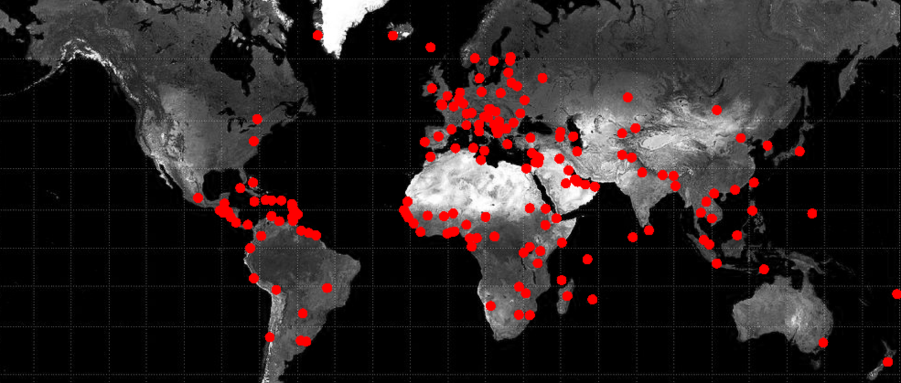

## Marque tes données

Affiche tes données sur la carte et rends-la interactive.

{:width="300px"}

Avant de pouvoir mettre des épingles sur la carte pour chaque endroit où tu as des données, tu dois savoir où se trouvent ces endroits. Le projet de départ comprend du code pour te fournir ces emplacements.

Tu peux utiliser `get_region_coords()` pour retourner un dictionnaire des coordonnées pour une région. Par exemple `get_region_coords('Japan')` retournera `{'x': 880.151122422, 'y': 278.639809465}`.

--- task ---

Définis une fonction `dessine_donnees()` pour placer tes données sur la carte. Au début, tu peux simplement afficher le nom de la région et ses coordonnées `x` et `y`.

Elle devrait parcourir ta liste de régions `liste_regions` et imprimer une ligne pour chaque région.

--- code ---
---
language: python
filename: main.py — draw_data()
---
def dessine_donnees():
    for region in liste_regions:
        nom_region = region['region'] # Obtenir le nom de la région
        region_coords = get_region_coords(nom_region) # Utilise le nom pour obtenir les coordonnées
        region_x = region_coords['x'] # Récupère la coordonnée x
        region_y = region_coords['y'] # Récupère la coordonnée y
        print(nom_region, region_x, region_y)

--- /code ---

--- /task ---

--- task ---

Dans ta fonction `setup()` commente ton code `dessine_epingle()` et à la place appelle `dessine_donnees()`.

--- code ---
---
language: python
filename: main.py - setup()
line_numbers: false
line_number_start: 
line_highlights: 12-13
---
def setup():
    # Mettre le code à exécuter une fois ici
    size(991, 768)
    image(
        carte, # L'image à dessiner
        0, # Le x du coin supérieur gauche
        0, # Le y du coin supérieur gauche
        width, # La largeur de l'image
        height # La hauteur de l'image
    )
    # dessine_epingle(300, 300, Color(255,0,0))
    dessine_donnees()
  
--- /code ---

--- /task ---

--- task ---

Au lieu d'imprimer le nom de la région et ses coordonnées, tu peux utiliser ta fonction `dessine_epingle()` pour placer tes épingles sur la carte. Le code ci-dessous colore les épingles en rouge (`Color(255, 0, 9)`), mais tu peux choisir une couleur différente.

--- code ---
---
language: python
filename: main.py — draw_data()
line_numbers: false
line_number_start: 
line_highlights: 7-9
---
def dessine_donnees():
    for region in liste_regions:
        nom_region = region['region'] # Obtenir le nom de la région
        region_coords = get_region_coords(nom_region) # Utilise le nom pour obtenir les coordonnées
        region_x = region_coords['x'] # Récupère la coordonnée x
        region_y = region_coords['y'] # Récupère la coordonnée y
        #print(nom_region, region_x, region_y)
        couleur_region = Color(255, 0, 0) # Définir la couleur de l'épingle
        dessine_epingle(region_x, region_y, couleur_region) # Dessiner l'épingle

--- /code ---

--- /task ---

--- task ---

**Test :** Exécute ton programme. Tu devrais voir beaucoup d'épingles apparaître sur ta carte ! Selon les données que tu as choisies, tu pourrais voir plus ou moins d'épingles que dans l'image ci-dessous.

--- /task ---

Ensuite, tu dois ajouter du code pour permettre aux utilisateurs de cliquer sur une épingle et voir des informations affichées. Pour cela, chaque épingle doit être d'une couleur différente, et tu as besoin d'un moyen d'associer ces couleurs aux bonnes données.

--- task ---

**Choisis :** Chaque épingle a besoin d'une couleur unique. Mais il existe de nombreuses façons différentes de le faire. Voici quelques suggestions, mais tu peux créer les tiennes.

--- collapse ---
---
title: Changer la valeur d'une couleur
---
Cet exemple modifie la valeur du rouge à chaque fois que le code place une épingle :

--- code ---
---
language: python
filename: main.py — draw_data()
line_numbers: false
line_number_start: 
line_highlights: 2, 9, 11
---
def dessine_donnees():
    valeur_rouge = 255 # Définir une valeur de départ pour le rouge

    for region in liste_regions:
        nom_region = region['nom']
        region_coords = get_region_coords(nom_region)
        region_x = region_coords['x']
        region_y = region_coords['y']
        region_colour = Color(valeur_rouge, 0, 0) # Utilise la valeur rouge dans la couleur
        dessine_epingle(region_x, region_y, couleur_region)
        valeur_rouge -= 1 # Change la valeur du rouge

--- /code ---

--- /collapse ---

--- collapse ---
---
title: Modifier la valeur de plusieurs couleurs
---
Cet exemple modifie les valeurs du rouge, du vert et du bleu à chaque fois que le code place une épingle :

--- code ---
---
language: python
filename: main.py — draw_data()
line_numbers: false
line_number_start: 
line_highlights: 2-4, 10, 12-14
---
def dessine_donnees():
    valeur_rouge = 255 # Set a starting value for red
    valeur_bleu = 0
    valeur_vert = 255
    for region in liste_regions:
        nom_region = region['region']
        region_coords = get_region_coords(nom_region)
        region_x = region_coords['x']
        region_y = region_coords['y']
        couleur_region = Color(valeur_rouge, valeur_vert, valeur_bleu) # Utiliser toutes les couleurs
        dessine_epingle(region_x, region_y, couleur_region)
        valeur_rouge -= 1 # Change la valeur du rouge
        valeur_vert += 1 # Change la valeur du vert
        valeur_bleu -= 1 # Change la valeur du bleu

--- /code ---

--- /collapse ---

--- collapse ---
---
title: Choisir des couleurs aléatoires
---

Au début de ton code, avec tes autres imports, tu devras importer `randint` depuis la bibliothèque `random`.

Tu peux alors choisir une couleur aléatoire pour les couleurs de tes régions ; une couleur différente sera choisie à chaque fois que la boucle `for` est exécutée. Il y a une petite chance que deux couleurs ou plus finissent par être les mêmes, mais c'est une très petite chance.

**Avertissement :** Une nouvelle couleur sera choisie à chaque fois que la carte se dessine, donc tes épingles clignoteront.

--- code ---
---
language: python
filename: main.py — draw_data()
line_numbers: false
line_number_start:
line_highlights: 1, 9
---
from random import randint

def dessine_donnees():
    for region in liste_regions:
        nom_region = region['nom']
        region_coords = get_region_coords(nom_region)
        region_x = region_coords['x']
        region_y = region_coords['y']
        couleur_region = Color(randint(0,255), randint(0,255), randint(0,255)) # Sélectionne une couleur aléatoire
        dessine_epingle(region_x, region_y, couleur_region)

--- /code ---

--- /collapse ---

--- /task ---

--- task ---

**Test :** Exécute ton programme et vérifie que les épingles sont de couleurs différentes. Si tu n'as pas beaucoup d'épingles, cela pourrait être difficile à remarquer. Dans ce cas, essaie d'utiliser des changements plus importants entre chaque épingle.

--- /task ---

Ta carte a des épingles uniques pour chaque emplacement, mais tu dois ajouter du code pour relier ces épingles aux informations que tu veux montrer à tes utilisateurs.

--- task ---

Pour utiliser la couleur de l'épingle pour rechercher les informations, tu dois **créer un dictionnaire** pour stocker les couleurs et les relier à la région.

--- code ---
---
language: python
filename: main.py
line_numbers: false
line_number_start: 
line_highlights: 7
---
#!/bin/python3
from p5 import *
from regions import get_region_coords
from random import randint

liste_regions = []
couleurs = {}
--- /code ---

--- /task ---

--- task ---

Au fur et à mesure que les épingles sont placées, la `region` peut être stockée dans le dictionnaire avec la couleur de l'épingle.

--- code ---
---
language: python
filename: main.py
line_numbers: false
line_number_start: 
line_highlights: 9
---
def dessine_donnees():
    valeur_rouge = 255
    for region in liste_regions:
        nom_region = region['region'] # Obtenir le nom de la région
        region_coords = get_region_coords(nom_region) # Utilise le nom pour obtenir les coordonnées
        region_x = region_coords['x'] # Récupère la coordonnée x
        region_y = region_coords['y'] # Récupère la coordonnée y
        couleur_region = Color(valeur_rouge, 100, 0) # Définir la couleur de l'épingle
        couleurs[couleur_region.hex] = region
        dessine_epingle(region_x, region_y, couleur_region)
        valeur_rouge -= 1
--- /code ---

--- /task ---

Lorsque l'utilisateur clique sur une épingle, la valeur hexadécimale de la couleur de l'épingle est récupérée, puis la région correspondante est trouvée dans le dictionnaire.

--- task ---

Dans ta fonction `mouse_pressed()`, recherche la `couleur_pixel` dans le dictionnaire `couleurs` et imprime la `region`.

**Souviens-toi** que `couleurs` est un dictionnaire de dictionnaires. Tu devras obtenir le dictionnaire d'informations sur la région, puis obtenir les informations à l'intérieur de ce dictionnaire. Par exemple :

--- code ---
---
language: python
filename: main.py
line_numbers: false
line_number_start: 
line_highlights: 4-5
---
def mouse_pressed():
    # Place ici le code à exécuter lorsque la souris est cliquée
    couleur_pixel = Color(get(mouse_x, mouse_y)).hex
    faits = couleurs[couleur_pixel]
    print(faits['region'])
--- /code ---

--- /task ---

--- task ---

Il est important de vérifier si une clé est dans un dictionnaire. Si tu cliques sur une zone de la carte sans épingle, tu recevras une `KeyError`.

Tu peux vérifier si une valeur est dans un dictionnaire en utilisant `in`:

--- code ---
---
language: python
filename: main.py
line_numbers: false
line_number_start: 
line_highlights: 4-8
---
def mouse_pressed():
    # Place ici le code à exécuter lorsque la souris est cliquée
    couleur_pixel = Color(get(mouse_x, mouse_y)).hex
    if couleur_pixel in couleurs:
        faits = couleurs[couleur_pixel]
        print(faits['region'])
    else:
        print('Région non détectée')
--- /code ---

--- /task ---

--- task ---

**Test :** Exécute ton programme. Clique sur une épingle et vérifie que ton programme imprime correctement les données sur cette zone.

--- /task ---

--- task ---

Tu peux afficher d'autres faits sur la région sur laquelle tu as cliqué en ajoutant plus d'instructions `print()`. Cela dépendra du jeu de données que tu as utilisé. Si tu as utilisé `happy.csv` par exemple, tu pourras imprimer les éléments suivants :

--- code ---
---
language: python
filename: main.py
line_numbers: false
line_number_start: 
line_highlights: 7-8
---
def mouse_pressed():
    # Place ici le code à exécuter lorsque la souris est cliquée
    couleur_pixel = Color(get(mouse_x, mouse_y)).hex
    if couleur_pixel in couleurs:
        faits = couleurs[couleur_pixel]
        print(faits['region'])
        print(faits['score_bonheur'])  # Ton premier fait de données
        print(faits['classement_bonheur'])  # Ton deuxième fait de données
    else:
        print('Région non détectée')
--- /code ---

--- /task ---

--- task ---

**Débogage :** Tu pourrais trouver des bogues dans ton projet que tu dois corriger. Voici quelques bogues courants.

--- collapse ---
---
title: Mes épingles n'apparaissent pas sur la carte
---

If your pins are not appearing on the map, check that you are calling your `dessine_donnees()` function from your `setup()` function.

--- /collapse ---

--- collapse ---
---
title: Je reçois un message concernant une 'KeyError'
---

Si tu reçois un message concernant une 'KeyError', vérifie que l'orthographe des clés de ton dictionnaire correspond lorsque tu y mets des valeurs et lorsque tu les lis. Que les lettres soient EN MAJUSCULES ou en minuscules est également important.

Si l'erreur concerne le dictionnaire `couleurs`, assure-toi de vérifier que la clé existe dans `couleurs` avant d'essayer d'obtenir la valeur.

--- /collapse ---

--- collapse ---
---
title: Il affiche toujours 'Région non détectée'
---

Ton clic de souris doit être au centre de ton épingle pour t'assurer qu'il détecte la bonne couleur.

Essaie de cliquer plus près du centre de ton épingle.

--- /collapse ---

--- /task ---

--- save ---
