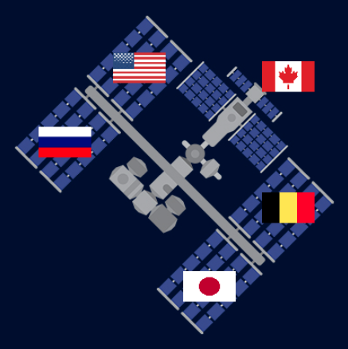

## What next?

If you are following the [More Python](https://projects.raspberrypi.org/en/raspberrypi/more-python) path, you can move on to the [Persuasive presentation](https://projects.raspberrypi.org/en/projects/persuasive-data-presentation) project. In this project, you will make a visual presentation of your own design, based on data you choose.

--- print-only ---

{:width="400px"}

--- /print-only ---

--- no-print ---

<iframe src="https://editor.raspberrypi.org/en/embed/viewer/data-iss-example" width="600" height="600" frameborder="0" marginwidth="0" marginheight="0" allowfullscreen>
</iframe>

--- /no-print ---

If you want to have more fun exploring Python, then you could try out any of [these projects](https://projects.raspberrypi.org/en/projects?software%5B%5D=python).
