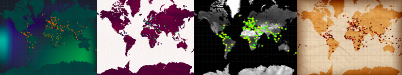

## Wat ga je maken

Gebruik Python om een interactieve kaart te maken waarmee gebruikers interessante feiten over de wereld leren.

Je gaat:
+ Lijsten en dictionaries gebruiken om data op te slaan
+ Functies en parameters gebruiken om je code overzichtelijk te houden
+ Code gebruiken om snel grote hoeveelheden data te verkennen

--- no-print ---

--- task ---

### Afspelen ▶️

Voer dit voorbeeld uit.

Klik op de gekleurde spelden om informatie over dat gebied te zien. Denk aan het soort gegevens dat je wilt weergeven, en hoe je een interessante speld kunt ontwerpen om deze op een kaart te markeren.

**Wereld geluksmetingen**:
<iframe src="https://editor.raspberrypi.org/en/embed/viewer/world-happiness-measures" width="600" height="600" frameborder="0" marginwidth="0" marginheight="0" allowfullscreen>
</iframe> Je kunt het Wereld geluksmetingen project [hier](https://editor.raspberrypi.org/en/projects/world-happiness-measures){:target="_ blank"} vinden

--- /task ---

**Kaartprojecties** zijn de verschillende manieren om de aarde op een kaart te tekenen. Het is niet mogelijk om een 2D-kaart te maken die de werkelijke afmetingen en afstanden weergeeft die in de 3D-wereld bestaan, hoewel kaartenmakers er steeds beter in worden. De kaart in dit project maakt gebruik van de web mercator projectie, dezelfde die wordt gebruikt door sites als Google Maps. Door deze projectie lijken plaatsen dichter bij de polen groter dan ze zijn: Groenland is een stuk kleiner dan deze kaart laat zien en, ter vergelijking, Afrika is een stuk groter.

### Ideeën opdoen 💭

Je gaat enkele ontwerpbesluiten nemen over welke gegevens je wilt laten zien aan jouw gebruikers, en ook welke stijl van kaart en spelden je zal gebruiken om die gegevens weer te geven.

--- task ---

Bekijk deze voorbeeldprojecten om meer ideeën op te doen:

**Ink wereld geluk:**:
<iframe src="https://editor.raspberrypi.org/en/embed/viewer/ink-world-happiness" width="600" height="600" frameborder="0" marginwidth="0" marginheight="0" allowfullscreen>
</iframe> Je kunt het Ink Wereld geluk-project[ hier vinden](https://editor.raspberrypi.org/en/projects/ink-world-happiness){:target="_blank"}

**Wereldkoolstofgegevens:**:
<iframe src="https://editor.raspberrypi.org/en/embed/viewer/world-carbon-data" width="600" height="600" frameborder="0" marginwidth="0" marginheight="0" allowfullscreen>
</iframe> Je kunt het Wereld koolstof data project [hier vinden](https://editor.raspberrypi.org/en/projects/world-carbon-data){:target="_ blank"}

**GDP**:
<iframe src="https://editor.raspberrypi.org/en/embed/viewer/mapping-data-gdp" width="600" height="600" frameborder="0" marginwidth="0" marginheight="0" allowfullscreen>
</iframe> Je kunt het BBP-project [hier vinden](https://editor.raspberrypi.org/en/projects/mapping-data-gdp){:target="_blank"}

--- /task ---

--- /no-print ---

--- print-only ---

### Ideeën opdoen 💭

Je gaat enkele ontwerpbesluiten nemen over welke gegevens je wilt laten zien aan jouw gebruikers, en ook welke stijl van kaart en spelden je zal gebruiken om die gegevens weer te geven.

{:width="300px"}
Je kunt de Wereld geluk meting project hier vinden https://editor.raspberrypi. rg/en/projects/world-happiness-measures {:width="300px"}
Je kunt het Ink wereld geluk project hier vinden https://editor.raspberrypi. rg/en/projects/ink-world-happiness {:width="300px"}
Je kunt het Wereld CO2 data project hier vinden https://editor.raspberrypi. rg/en/projects/world-carbon-data {:width="300px"}
Je kunt het BBP project hier vinden https://editor.raspberrypi.org/en/projects/mapping-data-gdp

--- /print-only ---

