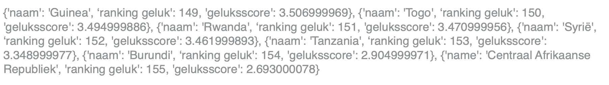
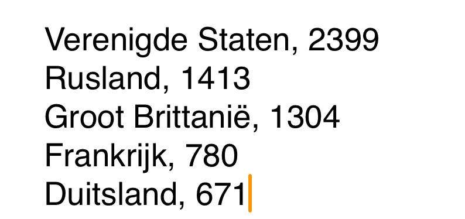

## Kies en laad een dataset

<div style="display: flex; flex-wrap: wrap">
<div style="flex-basis: 200px; flex-grow: 1; margin-right: 15px;">
Heb je een idee van het soort weergave dat je wilt maken? Gebruik deze stap om je gegevens te kiezen en deze in dictionaries te laden. Later gebruik je die dictionaries om je kaart te maken.
</div>
<div>

</div>
</div>

{:width="600px"}

--- task ---

Open het [Mapping Data starter project](https://editor.raspberrypi.org/nl-NL/projects/mapping-data-starter){:target="_blank"} project. De code-editor wordt geopend in een ander browsertabblad.

Als je een Raspberry Pi-account hebt, kun je op de **Save** knop klikken om een kopie op te slaan in je **Projects**.

--- /task ---

--- task ---

Voordat je jouw gegevens op een kaart kunt zetten, moet je enkele gegevens kiezen om weer te geven.

**Kies:** Er zijn een paar CSV-bestanden opgenomen in het startproject. Lees hieronder hun beschrijvingen. Noteer de naam van het bestand dat je wilt gebruiken in jouw weergave.

<div style="border-left: solid; border-width:10px; border-color: #0faeb0; background-color: aliceblue; padding: 10px;">
<span style="color: #0faeb0">**CSV-bestanden**</span> zijn bestanden met door komma's gescheiden waarden. Ze bevatten gegevens in rijen en kolommen, zoals een tabel. Elke regel is een rij, waarbij komma's de waarden van die rij in kolommen scheiden.
{:width="200px"}
</div>

--- collapse ---
---
title: Olympische gastlanden
---

**Bestandsnaam:** `olympics.csv`

Deze gegevens zijn een lijst met regio's waar de Olympische Zomerspelen hebben plaatsgevonden. De kolommen met gegevens zijn:

 - De naam van de regio
 - Het aantal keren dat ze de Spelen hebben georganiseerd

Hier is een voorbeeld van de gegevens in dit bestand:

```
Verenigde Staten,4
Verenigd Koninkrijk,3
Griekenland,3
```

--- /collapse ---

--- collapse ---
---
title: Wereldbevolking
---

**Bestandsnaam:** `pop.csv`

Deze gegevens gaan over aantal inwoners over de hele wereld. De kolommen met gegevens zijn:

 - De naam van de regio
 - Hoeveel mensen in de regio wonen
 - Hoeveel mensen wonen op elke vierkante kilometer van de regio
 - De gemiddelde leeftijd van mensen in de regio
 - Het percentage mensen in die regio dat in steden woont

Hier is een voorbeeld van de gegevens in dit bestand:

```
Afghanistan,38928346,60,18,25
Albanië,2877797,105,36,63
Algerije,43851044,18,29,73
```

--- /collapse ---

--- collapse ---
---
title: Koolstof emissies
---

**Bestandsnaam:** `carbon.csv`

Deze gegevens gaan over de Co2-uitstoot over de hele wereld. De cijfers in het bestand zijn voor één jaar. De kolommen met gegevens zijn:

 - De naam van de regio
 - Hoeveel koolstof elke regio in totaal uitstoot (in duizenden tonnen)
 - Hoeveel koolstof elke regio uitstoot, per persoon die in die regio woont (in ton)

Hier is een voorbeeld van de gegevens in dit bestand:

```
Albanië,4342.011,1.511
Algerije,130493.653,3.158
Angola,18021.394,0.605
```

--- /collapse ---

--- collapse ---
---
title: Bedreigde soorten
---

**Bestandsnaam:** `species.csv`

Deze gegevens gaan over het aantal planten- en diersoorten dat in elke regio wordt bedreigd. De kolommen met gegevens zijn:

 - De naam van de regio
 - Het aantal bedreigde soorten in die regio

Hier is een voorbeeld van de gegevens in dit bestand:

```
Afghanistan,42
Albanië,130
Algerije,135
```

--- /collapse ---

--- collapse ---
---
title: Nationale rijkdom
---

**Bestandsnaam:** `gdp.csv`

Het bruto binnenlands product (BBP) van een regio meet de omvang van zijn economie. Regio's met een groter BBP zijn doorgaans rijker. De kolommen met gegevens zijn:

 - De naam van de regio
 - Het totale BBP van die regio

Hier is een voorbeeld van de gegevens in dit bestand:

```
Aruba,3056424581
Afghanistan,18869945678
Angola,1.22124E+11
```

--- /collapse ---

--- collapse ---
---
title: Wereldgeluk
---

**Bestandsnaam:** `happy.csv`

Deze gegevens komen uit het World Happiness Report. Het rapport is een onderzoek naar het geluk van mensen in verschillende regio’s. Mensen werd gevraagd hun geluk een score te geven op een schaal van 0 tot 10. De kolommen met gegevens zijn:

 - De naam van de regio
 - Waar die regio in de wereld scoort op het gebied van gemiddeld geluk
 - De gemiddelde geluksscore voor de regio

Hier is een voorbeeld van de gegevens in dit bestand:

```
Noorwegen,1,7.537000179
Denemarken,2,7.521999836
IJsland,3,7.504000187
```

--- /collapse ---

--- /task ---

--- task ---

Nu je je gegevens hebt geselecteerd, moet je ze in je programma laden.

Definieer een `laad_data()` functie om een `bestandsnaam` variabele te nemen. Laat je functie dat bestand openen en `print()` elke regel erin.

[[[parameters]]]

--- code ---
---
language: python
filename: main.py laad_gegevens()
line_numbers: true
line_number_start: 13
line_highlights: 17-20
---
# Zet code hier die moet worden uitgevoerd wanneer de muis wordt ingedrukt
def mouse_pressed():
    pixel_kleur = Color(get(mouse_x, mouse_y)).hex

def laad_gegevens(bestand_naam):
    with open(bestand_naam) as f:
        for lijn in f:
            print(lijn)
--- /code ---

**Tip:** Je gaat in de komende paar stappen veel data verplaatsen. Het is een goed idee om `print()` te gebruiken. Dit helpt je te begrijpen hoe je data eruit ziet bij elke stap. Het is ook goed voor het opsporen van fouten. Je kunt deze `print` regels later uitschakelen via een comment (met `#`).

--- /task ---

--- task ---

Voeg een aanroep toe aan `laad_data()` in je `setup()` functie, je kunt de `pass` verwijderen die er al inzit. Geef de naam door van het data bestand dat je hierboven hebt gekozen. Je kunt de onderstaande lijst checken als je een herinnering van de bestandsnaam nodig hebt.

 - Olympische gastlanden — `olympics.csv`
 - Wereldbevolking — `pop.csv`
 - Koolstofemissies — `carbon.csv`
 - Bedreigde soorten — `species.csv`
 - Nationale rijkdom — `gdp.csv`
 - Wereldgeluk — `happy.csv`

--- /task ---

--- task ---

**Test:** Voer je programma uit. Controleer de gegevens die worden afgedrukt in het uitvoergebied.

**Fouten opsporen:** Je kunt een foutmelding krijgen dat je bestandsnaam 'not defined (niet gedefinieerd)' is. Als dit het geval is, controleer dan of je de naam tussen aanhalingstekens hebt geplaatst wanneer je de functie `laad_data()` aanroept. Bijvoorbeeld `laad_data('pop.csv')`.

--- /task ---

Nu de gegevens zijn geladen, moet je de gegevens voor elke regio ophalen en deze in een lijst opdelen. Dan kun je die lijst in een dictionary laden.

--- task ---

Voeg code toe aan de functie `laad_data()` om de functie `split()` te gebruiken om elke regel in een lijst op te splitsen. Noem die lijst `info`.

--- collapse ---
---
title: Splits een tekenreeks in een lijst
---

De functie `split()` verdeelt een tekenreeks in een lijst. `split(',')` maakt een nieuw lijstitem telkens wanneer het een komma ziet. Dus,

```python
info = 'Estland,1326535,31,42,68'
mijn_lijst = info.split(',')
```

zou `['Estland', '1326535', '31', '42', '68']` in `mijn_lijst` plaatsen.

--- /collapse ---

--- code ---
---
language: python
filename: main.py laad_gegevens()
line_numbers: false
line_number_start: 
line_highlights: 5-6
---
def laad_gegevens(bestand_naam):
    with open(bestand_naam) as f:
        for lijn in f:
            #print(lijn)
            info = lijn.split(',')
--- /code ---

--- /task ---

Gebruik nu de lijst die je hebt gemaakt van de data van elke regio om een dictionary te maken voor elke regio. Voeg de naam van de regio en de getallen die je wilt gebruiken in jouw weergave toe.

--- task ---

Voeg code toe aan je `laad_data()` functie die de door jou gekozen gegevens omzet in een dictionary.

Gebruik `print()` om te controleren of de dictionaries er uitzien zoals je verwacht.

--- collapse ---

---
title: Veld namen voor de csv-bestanden
---

Olympische gastlanden — `olympics.csv`
   - De naam van de regio
   - Het aantal keren dat ze de Spelen hebben georganiseerd

Wereldbevolking — `pop.csv`
   - De naam van de regio
   - Hoeveel mensen in de regio wonen
   - Hoeveel mensen wonen op elke vierkante kilometer van de regio
   - De gemiddelde leeftijd van mensen in de regio
   - Het percentage mensen in die regio dat in steden woont

Koolstofemissies — `carbon.csv`
  - De naam van de regio
  - Hoeveel koolstof elke regio in totaal uitstoot (in duizenden tonnen)
  - Hoeveel koolstof elke regio uitstoot, per persoon die in die regio woont (in ton)

Bedreigde soorten — `species.csv`
  - De naam van de regio
  - Het aantal bedreigde soorten in die regio

Nationale rijkdom - `gdp.csv`
 - De naam van de regio
 - Het totale BBP van die regio

Wereldgeluk — `happy.csv`
  - De naam van de regio
  - Ranking geluk
  - Geluksscore

--- /collapse ---

--- code ---
---
language: python
filename: main.py laad_gegevens()
line_numbers: false
line_number_start: 
line_highlights: 7-13
---
def laad_gegevens(bestand_naam):
    with open(bestand_naam) as f:
        for lijn in f:
            #print(lijn)
            info = lijn.split(',')
            # Wijzig de dictionary zodat deze overeenkomt met de gegevens die je gebruikt
            regio_dict = {
                'regio': info[0],
                'ranking geluk': info[1],
                'geluksscore': info[2]
            }
            print(regio_dict)
--- /code ---

--- /task ---

--- task ---

**Test:** Voer je code uit en controleer of de dictionaries die worden afgedrukt er uitzien zoals je verwacht: een 'naam'-sleutel met een tekenreeks voor een waarde, en welke sleutels en waarden je ook verwacht op basis van je code.

**Fouten oplossen:** Als je een bericht ziet over `list index out of range (lijst index buiten bereik)`, controleer dan of je het juiste aantal waarden in jouw regio dictionary probeert te laden. Dit kan een ander aantal waarden zijn dan de bovenstaande voorbeeldcode. Je moet ook sleutelnamen gebruiken die overeenkomen met de gegevens die je hebt gekozen.

--- /task ---

Nu maakt je `laad_data()` functie een dictionary voor elke regio. Je moet die dictionaries ergens opslaan waar de rest van je programma ze kan ophalen. Een lijst is een goede keuze.

--- task ---

Maak een lege lijst genaamd `regio_lijst`.

--- code ---
---
language: python
filename: main.py
line_numbers: false
line_number_start: 
line_highlights: 6
---
#!/bin/python3
from p5 import *
from regions import haal_regio_coordinaten

regio_lijst = []
--- /code ---

Voeg in `laad_data()`al je dictionaries toe aan `regio_lijst` met behulp van `append`. Hiermee kun je in de rest van je programma werken met de gegevens.

--- code ---
---
language: python
filename: main.py - laad_gegevens()
line_numbers: false
line_number_start: 
line_highlights: 11
---
def laad_gegevens(bestand_naam):
    with open(bestand_naam) as f:
        for lijn in f:
            info = lijn.split(',')
            regio_dict = {
                'regio': info[0],
                'ranking geluk': info[1],
                'geluksscore': info[2]
            }
            #print(regio_dict)
            regio_lijst.append(regio_dict)

--- /code ---

--- /task ---

--- task ---

Voeg een regel toe in je `setup()` functie die de `regio_lijst` afdrukt.

--- /task ---

--- task ---

**Test:** Voer je programma uit en controleer of het een lijst met dictionaries afdrukt. Het zou er ongeveer zo uit moeten zien:


**Tip:** Net als de andere `print()` -instructies die je hebt gebruikt, kun je deze regel veranderen in een comment zodra je hem hebt gebruikt voor testen en je code werkt zoals verwacht.

--- /task ---

--- task ---

**Fouten opsporen:** Mogelijk vind je enkele fouten in jouw project die je moet oplossen. Hier zijn enkele veelvoorkomende fouten.

--- collapse ---
---
title: Mijn code wordt niet uitgevoerd
---

Controleer of je code correct ingesprongen is. De code onder de `with` moet worden ingesprongen, en vervolgens moet de `for` lus opnieuw worden ingesprongen.

--- /collapse ---

--- collapse ---
---
title: Ik krijg een melding dat het csv-bestand 'not defined (niet gedefinieerd)' is
---

Controleer je aanroep van `laad_data()` om er zeker van te zijn dat de naam van het bestand een string is.

--- /collapse ---

--- collapse ---
---
title: Mijn info lijst bevat slechts één groot item
---

Controleer of je `','` hebt in de `()` van `line.split()`

--- /collapse ---

--- collapse ---
---
title: Ik krijg de melding dat de split 'not defined (niet gedefinieerd)' is
---

Als je een bericht ziet dat `split` 'niet gedefinieerd' is, controleer dan of je `line.` ervoor hebt gezet.

--- /collapse ---

--- collapse ---
---
title: Ik krijg een bericht dat regio_lijst 'not defined (niet gedefinieerd)' is
---

Als je een bericht ziet dat `regio_lijst` 'niet gedefinieerd' is, controleer dan of je deze als lege lijst hebt aangemaakt — met `regio_ljist = []` — voordat je er dingen aan probeert toe te voegen

--- /collapse ---

--- /task ---

--- save ---
