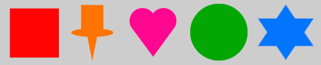

## Kies een kaart en spelden

<div style="display: flex; flex-wrap: wrap">
<div style="flex-basis: 200px; flex-grow: 1; margin-right: 15px;">
Kies hoe je de gegevens wilt weergeven die je hebt geselecteerd.
</div>
<div>
{:width="300px"}
</div>
</div>

--- task ---

Voeg code toe aan je `setup()` functie om de grootte van je canvas in te stellen op **991** pixels breed en **768** pixels hoog.

--- code ---
---
language: python filename: main.py - setup() line_numbers: false line_number_start:
line_highlights: 3
---
# Put code to run once here
def setup(): size(991, 768) load_data('happy.csv')


--- /code ---

--- /task ---

--- task ---

Denk na over hoe je de gegevens die je hebt gekozen wilt weergeven: wat voor kaart wil je gebruiken?
+ ink-map.jpg
+ mercator.jpeg
+ mercator_bw.png
+ old-map.jpg
+ computer-map.jpg


--- /task ---

--- task ---

**Kies:** Het startproject bevat vijf kaartafbeeldingen. Kies er een die je leuk vindt en laad de afbeelding in een `preload` functie.

--- code ---
---
language: python filename: main.py line_numbers: false line_number_start:
line_highlights: 3
---
def preload(): global map map = load_image('mercator.jpeg')

--- /code ---

--- /task ---

--- task ---

Voeg code toe aan je `setup()` functie om de kaart zo te tekenen dat deze het hele canvas bedekt.

[[[p5-coordinates]]]

--- code ---
---
language: python filename: main.py - setup() line_numbers: false line_number_start:
line_highlights: 5-12
---
def setup(): # Put code to run once here size(991, 768)   
load_data('happy.csv')  
image( map,  # The image to draw 0,  # The x of the top-left corner 0,  # The y of the top-left corner width,  # The width of the image height  # The height of the image ) --- /code ---

--- /task ---

--- task ---

**Test:** Voer je programma uit en kijk naar je kaart!

---/task---

--- task ---

**Kies:** Welke speld ga je op elke locatie plaatsen? Je speld moet één kleur hebben zodat een gebruiker er gemakkelijk op kan klikken.

Je kunt één vorm kiezen, zoals:
+ Een cirkel
+ Een vierkant
+ Een driehoek

Of je kunt een speld maken uit meerdere geometrische vormen, zoals:
+ Een hart
+ Een kaart speld
+ Een ster



--- /task ---

--- task ---

Definieer een functie met de naam `teken_speld`. Deze zou een speld, naar eigen ontwerp, moeten tekenen op de kaart. Er moeten drie parameters zijn:

 - De x-coördinaat voor de speld.
 - De y-coördinaat voor de speld.
 - De kleur van de speld. Dit moet een `p5` `Color()`zijn.

--- code ---
---
language: python filename: main.py - draw_pin() line_numbers: line_number_start:
line_highlights:
---
def draw_pin(x, y, colour): # Put code to draw your pin here --- /code ---

Terwijl je jouw `teken_speld` functie maakt, roep deze aan om te zien hoe deze op het scherm verschijnt. Je moet de functie `teken_speld` aanroepen vanuit de functie `setup()`.

Je kunt de hieronder weergegeven argumenten gebruiken om een `rode` speld in het midden van het scherm te plaatsen.

--- code ---
---
language: python filename: main.py - setup() line_numbers: false line_number_start:
line_highlights: 11
---
def setup(): # Put code to run once here size(991, 768) image( map,  # The image to draw 0,  # The x of the top-left corner 0,  # The y of the top-left corner width,  # The width of the image height  # The height of the image ) draw_pin(300, 300, Color(255,0,0)) --- /code ---

[[[parameters]]]

--- collapse ---
---
title: Kleuren in p5
---

De functie `p5` `Color()` verwacht drie getallen: één voor rood, groen en blauw.

```python
blauw = Color(92, 204, 206) #Rood = 92, Groen = 204, Blauw = 206
```

Je kunt de functie `fill()` gebruiken om een vorm met kleur te vullen. `fill()` is van toepassing op elke vorm die erna wordt getekend.

```python
groen = Color(149, 212, 122)
fill(groen)
rect(0, 250, 400, 150) # Deze vorm wordt gevuld met de kleur
```

Om ervoor te zorgen dat fill ongedaan wordt gemaakt, roep je `no_fill()` aan voordat je jouw vorm(en) tekent.

Je kunt ook een kleur instellen voor de rand rond een vorm met de functie `stroke()`:

```python
wit = Color(255, 255, 255)
stroke(wit)
rect(0, 250, 400, 150) # Deze vorm heeft een witte rand
```

--- /collapse ---

[[[generic-theory-simple-colours]]]

[[[processing-python-ellipse]]]

[[[processing-python-rect]]]

[[[processing-python-triangle]]]

**Tip:** Je `teken_speld` functie kan andere vormen maken van deze basisvormen.

--- /task ---

--- task ---

**Fouten opsporen:** Mogelijk vind je enkele fouten in jouw project die je moet oplossen. Hier zijn enkele veelvoorkomende fouten.

--- collapse ---
---
title: Mijn kaart laadt niet
---

Controleer de bestandsnaam zorgvuldig - vergeet niet dat hoofdletters verschillen van kleine letters en leestekens belangrijk zijn.

--- /collapse ---

--- collapse ---
---
titel: Mijn kaart heeft het verkeerde formaat
---

Controleer de invoer die de breedte en hoogte van de afbeelding bepaalt:

```python
    image(
        map,  # De afbeelding die wordt getekend
        0,  # De x van de linkerbovenhoek
        0,  # De y van de linkerbovenhoek
        width,  # De breedte van de afbeelding
        height  # De hoogte van de afbeelding
    )
```

--- /collapse ---

--- collapse ---
---
title: Mijn speld verschijnt niet
---

Zorg ervoor dat je de functie `teken_speld()` in je functie `draw()` hebt aangeroepen en de benodigde waarden hebt doorgegeven. Bijvoorbeeld:

--- code ---
---
language: python
filename: main.py - draw()
---

    draw_pin(width/2, height/2, Color(255,0,0))
--- /code ---

Zorg er ook voor dat je `teken_speld()` aanroept nadat je `image()` hebt aangeroepen om de achtergrond te maken. Zo niet, dan teken je de kaart over de speld!

--- /collapse ---

--- /task ---

--- save ---
