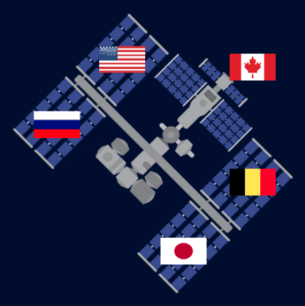

## Wat nu?

Als je het [Meer Python](https://projects.raspberrypi.org/nl-NL/raspberrypi/more-python) pad volgt, kun je verder gaan naar het [Overtuigende Presentatie](https://projects.raspberrypi.org/nl-NL/projects/persuasive-data-presentation) project. In dit project maak je een visuele presentatie van je eigen ontwerp, op basis van de door jou gekozen gegevens.

--- print-only ---

{:width="400px"}

--- /print-only ---

--- no-print ---

<iframe src="https://editor.raspberrypi.org/nl-NL/embed/viewer/data-iss-example" width="600" height="600" frameborder="0" marginwidth="0" marginheight="0" allowfullscreen>
</iframe>

--- /no-print ---

Als je meer plezier wilt hebben met het verkennen van Python, dan kun je een van [deze projecten](https://projects.raspberrypi.org/nl-NL/projects?software%5B%5D=python) uitproberen.

***

Dit project werd vertaald door vrijwilligers:

Iny van Beuningen
Sanneke van der Meer

Dankzij vrijwilligers kunnen we mensen over de hele wereld de kans geven om in hun eigen taal te leren. Jij kunt ons helpen meer mensen te bereiken door vrijwillig te starten met vertalen - meer informatie op [rpf.io/translate](https://rpf.io/translate).
